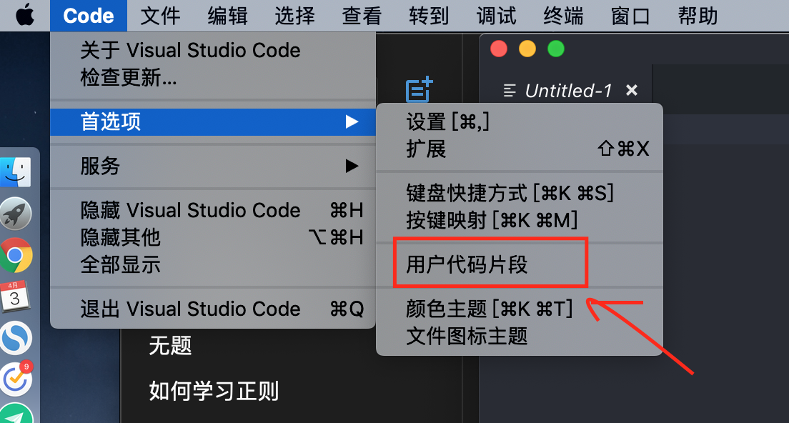
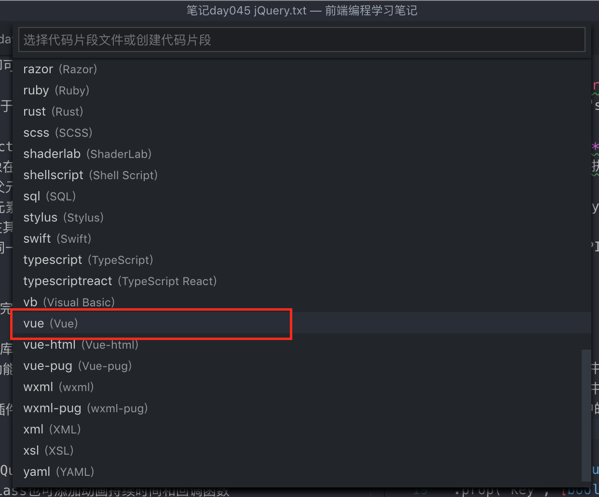
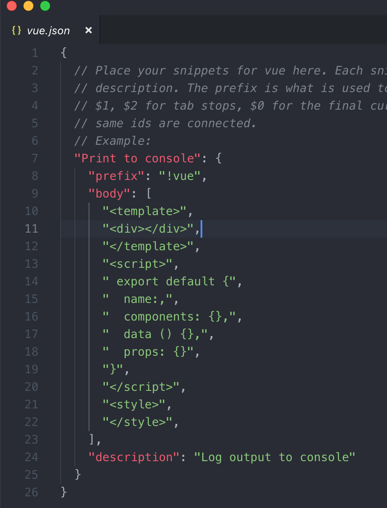
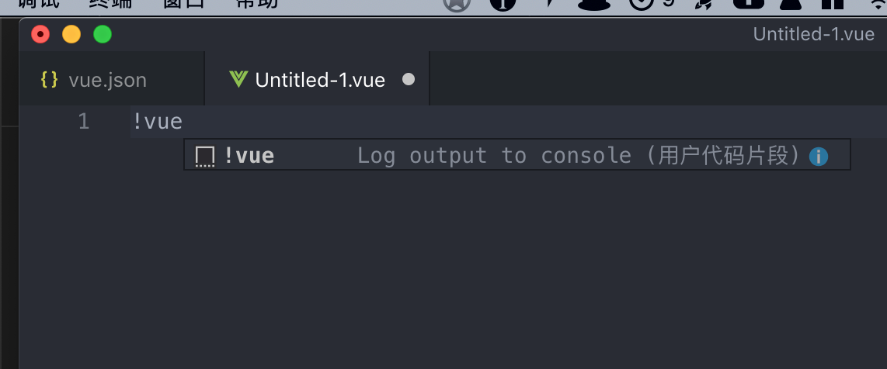
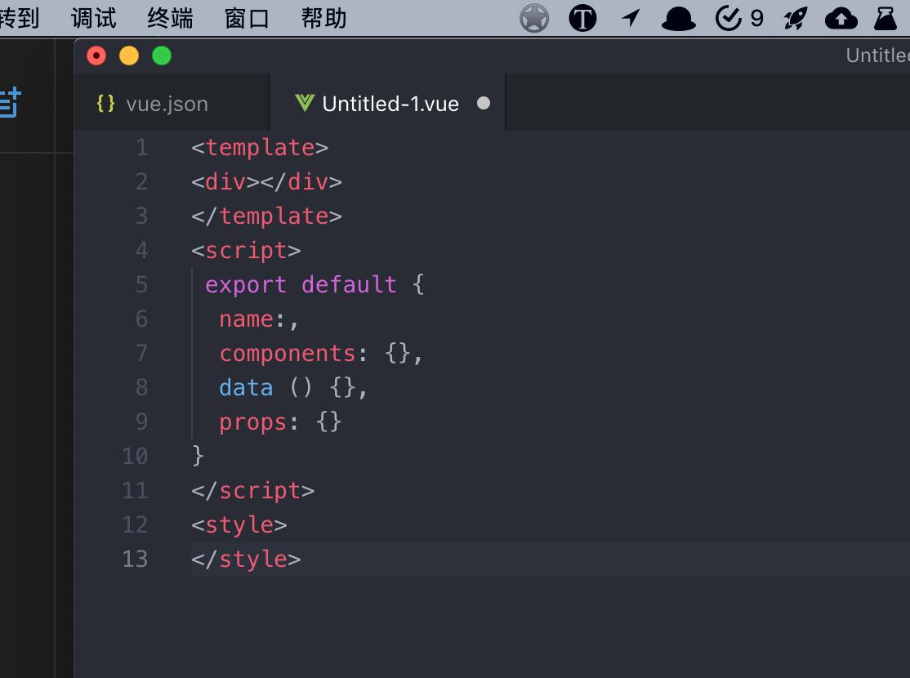

用 VS Code 写 HTML 网页时，只需按下`!`键，即可一键快速输入 HTML 基础模板，很享受这种便捷。
然而在写 Vue 的时候，试了几次都没找到快速输入 vue 模板方法。虽然单文件组件内容不多，但是组件多啊，这种不满一直不断累积。
直到前一阵子，是在无法忍受了，受不了这种效率底下的感受，经过一番折腾找到了解决方案，下面说说怎么做到的。
大致流程如下：

1. 创建新的 Vue 代码片段（snippet）
2. 自定义 Vue 模板，并设置代码片段识别符（类似指令，让编辑器知道你想要插入一个预设的代码片段）
3. 在 vue 文件中输入识别符，VS Code 会自动弹出菜单，按`回车`键快速插入

## 1. 创建 Vue 代码片段

打开 VS Code“用户代码片段”（User snippets），截图是 Mac 端举例，Windows 端也类似。

选择“vue (Vue)”，表示自定义.vue 文件的代码片段。

之后会进入到`vue.json`的编辑界面，JSON 文件中所填写的内容，会根据用户需求插入文档中。

## 2. 自定义 Vue 模板

根据个人经验，如下几点：

- 所有代码片段都只在`.vue`文件中才生效
- 一个代码片段对应 JSON 对象的一个属性
- 单个代码片段自身也是一个 JSON 对象，包含`prefix`、`body`、`description`等属性
  代码片段的语法也很简单：
- `prefix`表示识别符（前缀），编辑器会根据识别符的输入插入代码片段`body`中的内容
- `body`表示最终插入到文档中的代码内容
- `description`是注释，便于日后翻看和维护
- `$1`和`$2`等是指插入代码片段以后，光标在代码中停留的位置，按`TAB`切换位置，\$0 是指光标最终停留的位置。还可设置默认占位的内容，语法为：`${1:label}`。

## 3. 实现快速输入自定义 vue 模板内容

创建`.vue`文件，输入预设的识别符`prefix`字段对应的内容（我设置的`!vue`），会弹出提示，按下回车即可插入自定义的模板内容，简直爽歪歪，很享受高效的感觉，相信之后再创建 vue 单文件组件只会是一种享受，而不是一种难受。

看来编程还是需要不断提高生产力，才会感受到快乐，哈哈。
