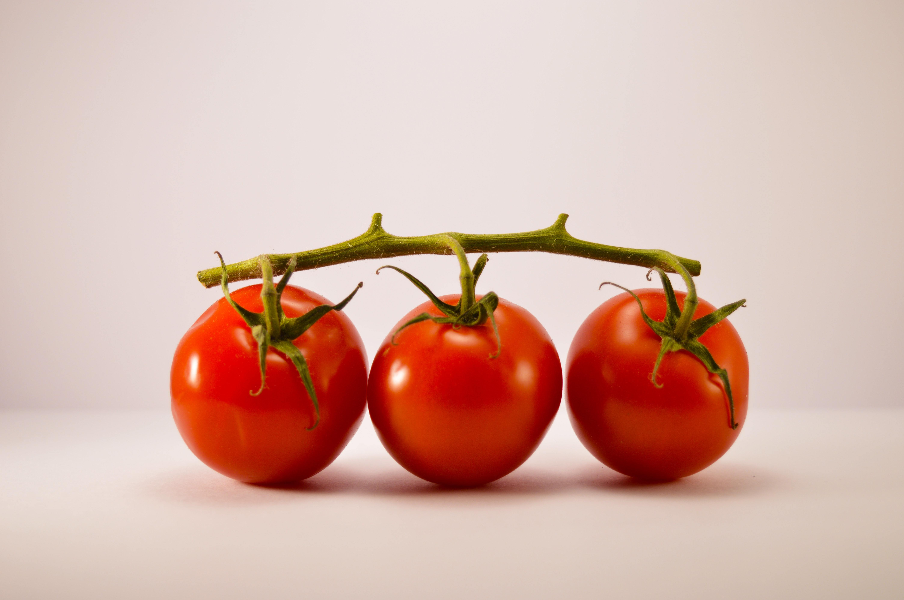

不断想办法提高自己的工作、学习效能的我们，很容易会接触到“番茄工作法”。它的简单易行，广为被人们所接受。然而，在用了两年多以后，我发现它可能并不适合我。

## 经验

差不多2年前，我从一个微信群里了解到了番茄工作法，后来便让自己用上了，在工作中和学习上立即用上了。

它上手简单、可操作性极强，一定程度上可以提升做事情的效率。一直到现在，都在断断续续的用着，多的时候一天能有10+个番茄（25分钟/番茄）。

然而用到现在，我发现了一个问题：由于一个番茄只有25分钟，刚刚要进入专注状态了，就被休息的5分钟时间给打断了，如同强行被打断，而且5分钟之后才能继续干刚才的事情。

这又引出了一连串问题：

1. 休息后很容易从5分钟扩大到15分钟甚至更长；
2. 25分钟过于碎片化，也意味着和心流体验（非常专注的状态）彻底无缘；
3. 由于无法长时间专注，因此很难和知识、事情建立起强连接；

这就非常有问题了，用了番茄工作法，说不定效率还不如不用的人呢。

很庆幸自己能发现这一点，也为这两年多自己的效率感到惋惜：为何到现在才发现番茄工作法问题呢？主要还是没有反思，不注重自身体验。

## 我的反思

我认为以25分钟为单位最大的缺点就是他会把你的时间碎片化，同时也会把你的注意力碎片化。可能让你无法长时间的专注一项工作，反而会主动分散你的注意力，无法让人进入专注的状态，也无法体会到心流体验。

偶然一次在 YouTube，看了一个英国大三的医学院学生 [Kharma Medic](https://www.youtube.com/watch?v=3NSkk31vFbU) 的视频。他每天学习8小时，他的学习方式很特别：上午4小时、下午4小时，每1小时之间有短暂休息，一天下来效率不错，完善还给自己留出了玩游戏和追剧的时间。

Kharma Medic 总结这种学习方式的优点：

- 最大化产出效率
- 尽可能减少休息
- 增加自由时间

他还总结了如何做到如此长时间坚持的诀窍：

- 提前一天晚上做好第二天的计划
- 减少起身次数（起身容易让自己分心，起码一小时后再起身）
- 把手机藏起来
- 给自己奖励（游戏、朋友玩、吃喝）

## 改进方案

看完 Kharma Medic 的视频，我立刻意识到这才是更好的工作/学习方法，原来的25分钟番茄太过于碎片化了。

你可能会说，一个番茄25分钟，我一天搞10个番茄不也5个小时时间了吗，也很可观么？

其实不然，我认为无论工作和学习，我们首先都应该把高效放在首位，就是千万不要“野蛮”的靠堆时间来衡量自己的产出，工作加班的道理也是一样的（见[加班与效率](https://coolshell.cn/articles/10217.html)）。

时长因素固然重要，但是却并不是最重要的。无论工作还是学习，最重要的是这段时间你所能创造的价值。所以做事情的时间不是越长越好，而是要提高单位时间内做事情的质量。

在我看来，学习或工作中，越是专注，就越能和知识建立强连接，无形当中你的学习、工作能力都有所增强。

因此我认为：`专注的价值>工作时长`，所以我决定把一个番茄的时间调整到1小时，因为25分钟和1小时所能带来的专注程度完全不同。

所以现在我基本上会每工作1小时再起身休息一下，应该会对于我的个人学习、工作有所影响。